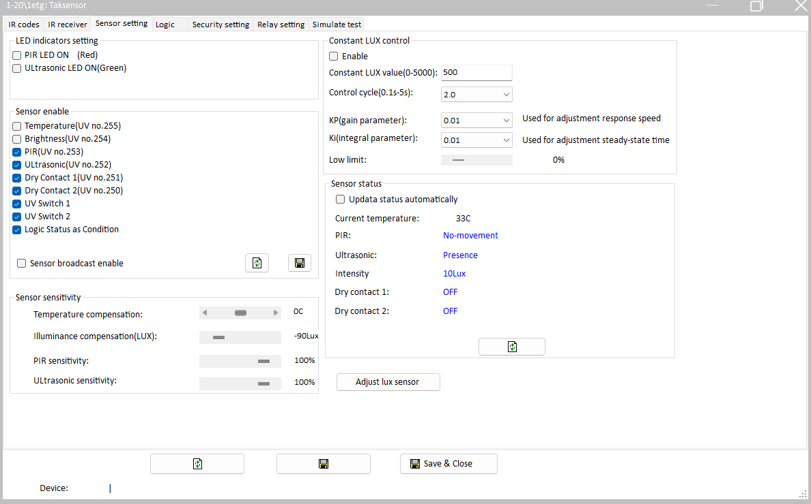
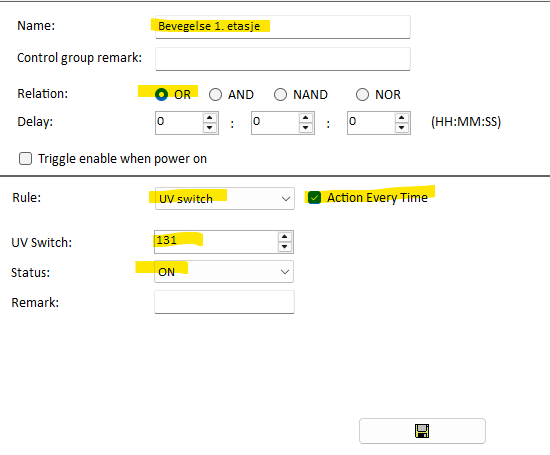

# HDL Multisensor and Homey Pro

## Introduction

This guide explains how to use an HDL multisensor with Homey Pro in a way that produces stable motion events.

Many users experience unreliable sensor readings when connecting multisensors directly to Homey. A more robust solution is to let the sensor trigger a UV-switch, pass that through a HDL Logic Controller, and then have the Logic Controller broadcast the UV-switch state across the entire bus. Homey can then read these UV-switches reliably.

The result is a motion setup that is hopefully far more stable in Homey than using the sensors directly. This method also enables you to use multiple HDL-sensors and although I'm not sure why, sensors that trigger UV-switches to a logic-controller respond much quicker than sensors that broadcasts these switches on the bus. 

💡 This setup has been tested with three 12-in-1 sensors and a logic controller running the latest firmware. Homey Pro is connected via Ethernet on the same subnet as the HDL IP interface. Your experience may vary depending on the modules installed and their firmware. Some users report faster sensor response when broadcasting directly from the sensor to the bus, but in general, the approach described in this guide should provide greater stability.

## Before You Start

* You’ll need **HDL Setup Tool v2** installed.

* Back up everything using **HDL Setup Tool v2**, especially the sensors and the logic-controller before making any changes. 

## UV-switches considerations

👉It is important to carefully plan the use of UV-switches. Start by making a list of the switches you intend to use and document each one. Make sure not to reuse existing UV-switches or use ranges reserved by HDL. From my experience, creating UV-switches between 50-200 are usually avaialable, **but avoid using 249-255** as these are typically reserved for specific functions. If you have multiple sensors with several programmed logic functions, this should be planned in detail.

Example:  
In my house, we use three sensors. Each sensor has logic for both PIR and Ultrasonic. To ensure reliable use of UV-switches, this requires at least six UV-switches, three for each PIR-sensor, and three for each Ultrasonic sensor. 

## Configuration

### Step 1 – Configure the Sensor Setting 

* Open the multisensor in **HDL Setup Tool v2**

* Check the page “Sensor setting”  
  * Make sure the correct sensors that you want to use are enabled

  * I initially tried working with the default UV-switches, but achieved better results by disabling broadcast and assigning custom UV-switches. Your experience may differ, but keep in mind that the default UV-switches are broadcast globally. When multiple sensors are in use and sending the same UV-switches on the bus, it makes it dofficult for Homey  to know which sensor is actually sending the signal.

  * PIR: Passive infrared sensor: Used for motion detection and useful for lights that should turn on when someone is moving through a room

  * Ultrasonic: Detects persons and pets, even when they are not moving.   
    Especially useful for rooms where people watch TV or dining rooms, where you want to know if someone is in the room or not. Where PIR has a tendency to turn off after someone has sat down on a couch, ultrasonic can still detect the person which enables some really powerful automations in Homey later on. 

💡 LED Indicators on some sensors, especially older 12-in-1 sensors, cause a small “buzzing” sound when enabled. Disabling the LED indicators solves this problem.

* Go to the “Logic” Tab.   
  * Enable a logic number, give it a name and choose which sensor that should be activated.   
  * In this example, we PIR **OR** Utrasonic. If it senses something on PIR or Ultrasonic, it will trigger.   
  * When using **OR**: The sensor will trigger if one or both are sensing something. We therefore recommend using **OR** instead of **AND** which requires both.

* If you want to separate PIR and Ultrasonic to different UV-switches, I recommend creating two logics.  

* For “True targets configuration”, send a UV-switch to the address of the logic-controller, define the UV-switch number and state (ON)  

* Do the same for “False targets configuration”, but turn the same switch off. 

### Step 2 – Enable broadcast from Logic-controller

* Open the Logic Module in the HDL **Setup Tool**.

  * Create a new block with an “OR Table”. I suggest calling the block “movement” or similar. OR-tables can be created individually for each sensor and UV-switch.  
  * PIN-Setup:   
    * Rule: UV Switch  
    * UV Switch: *The number you want to use*  
    * Status: ON  
    * Action every time

* Add Command and broadcast to index 1, subnet 255, device 255 the UV-switch with the “ON” status. This address is reserved for broadcasting signals across the entire bus. 

💡 You can create similar tables for OFF-status, but in my experience, as long as a broadcast has been completed from the logic-controller, the UV-switches OFF-status is handled pretty quickly without the need for a broadcast. Your experience may differ, but I suggest trying this method first. 

## Homey Automation Considerations

* **Sensor Sensitivity:** When moving to Homey, take the opportunity to experiment with different sensitivity settings. We experienced issues with the ultrasonic sensor triggering the hallway lights at night when sleeping with the bedroom door open. Reducing the ultrasonic sensor’s sensitivity to 80% solved the problem and turned out to be a much simpler solution than adjusting the flow in Homey to avoid this issue.

* **Cleaning Sensors:** Regular cleaning greatly improves reliability. Carefully clean the sensor at least twice a year using high-pressure air (intended for computer cleaning) and a microfiber cloth. This helps maintain accurate readings and reduces false triggers, but make sure that the sensor is not powered while cleaning it. 

* **LUX and Temperature can be great:** With proper care, LUX and temperature sensors can deliver good results. Keep the sensor clean, update it to the latest firmware, and calibrate it for better accuracy. For temperature, I calibrated against both an analog thermometer and a Netatmo digital sensor, also compensating for the ceiling-mounted position. After this adjustment, the sensor has proven to be a decent indicator of room temperature. While I wouldn’t rely on it for precise measurements, it works fine as a simple temperature reference. LUX measurement, on the other hand, is excellent. When the sensor is clean, it delivers very accurate readings and can confidently be used in automation flows without hesitation.
